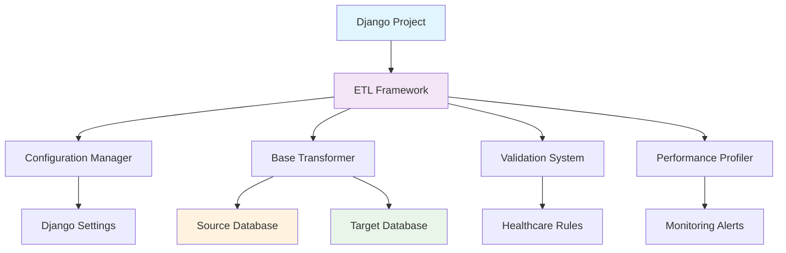

# Django ETL Framework 🚀

<p align="center">
  <strong>A comprehensive, production-ready ETL framework for Django applications</strong>
</p>

<p align="center">
  <a href="https://python.org">
    
  </a>
  <a href="https://djangoproject.com">
    
  </a>
  <a href="https://github.com/Click-Software-GH/django-etl/blob/main/LICENSE">
    
  </a>
</p>

<p align="center">
  <a href="getting-started/installation.md" class="md-button md-button--primary">Get Started</a>
  <a href="https://github.com/Click-Software-GH/django-etl" class="md-button">View on GitHub</a>
</p>

## 🏥 Designed for Healthcare

The Django ETL Framework is specifically engineered for healthcare data migration and complex database transformations, with built-in HIPAA compliance patterns and medical data validation rules.

## ✨ Key Features

<div class="grid cards" markdown>

-   :material-database-sync: **Cross-Database Support**

    ---

    MySQL, PostgreSQL, SQLite with automatic vendor detection and optimized queries for each database type.

-   :material-speedometer: **High Performance**

    ---

    Memory-efficient batch processing with configurable batch sizes. Process 50,000+ records per minute.

-   :material-shield-check: **Advanced Validation**

    ---

    Healthcare-specific validation rules with severity levels. HIPAA-compliant data handling patterns.

-   :material-chart-line: **Performance Profiling**

    ---

    Built-in monitoring and optimization recommendations. Real-time performance metrics and alerts.

-   :material-backup-restore: **Rollback & Recovery**

    ---

    Automatic backups and migration rollback capabilities. Never lose data during transformations.

-   :material-file-document: **Comprehensive Logging**

    ---

    Detailed audit trails and debugging information. Full traceability of all data transformations.

</div>

## 🚀 Quick Example

```python
from django_etl import BaseTransformer
from myapp.models import Patient
from legacy.models import LegacyPatient

class PatientTransformer(BaseTransformer):
    """Transform legacy patients to new patient model"""
    
    def get_source_data(self):
        return LegacyPatient.objects.using('legacy').all()
    
    def transform_batch(self, batch):
        patients = []
        for legacy_patient in batch:
            patient_data = {
                'first_name': self.clean_name(legacy_patient.name),
                'email': self.clean_email(legacy_patient.email),
                'phone': self.format_phone(legacy_patient.phone),
            }
            if self.validate_patient_data(patient_data):
                patients.append(Patient(**patient_data))
        return patients
    
    def save_batch(self, transformed_batch):
        Patient.objects.bulk_create(transformed_batch, ignore_conflicts=True)
        return len(transformed_batch)
```

Run your transformation:

```bash
python manage.py migrate_legacy_data --only patients --dry-run
```

## 📊 Performance Benchmarks

Tested on real healthcare datasets:

| Data Type | Records/Minute | Notes |
|-----------|----------------|-------|
| Patient Records | 10,000+ | With full validation |
| Medical Appointments | 25,000+ | Including relationship mapping |
| Insurance Claims | 5,000+ | Complex validation rules |
| Laboratory Results | 50,000+ | Simple transformations |

## 🎯 Perfect For

=== "Healthcare Systems"

    - **Hospital Management Systems** - Patient, doctor, appointment migrations
    - **Medical Records** - EMR/EHR system consolidations  
    - **Insurance Processing** - Claims and billing system migrations
    - **Laboratory Systems** - Test results and report migrations

=== "General Applications"

    - **E-commerce** - Product, order, customer data migrations
    - **CRM Systems** - Contact and lead management consolidations
    - **Financial Systems** - Transaction and account migrations
    - **Educational Systems** - Student and course data migrations

## 🏗️ Architecture



## 🤝 Community

- **[GitHub Issues](https://github.com/Click-Software-GH/django-etl/issues)** - Report bugs or request features
- **[GitHub Discussions](https://github.com/Click-Software-GH/django-etl/discussions)** - Ask questions or share ideas
- **[Email Support](mailto:etl-support@yourcompany.com)** - Direct support for complex issues

## 📄 License

This project is licensed under the MIT License - see the [LICENSE](https://github.com/Click-Software-GH/django-etl/blob/main/LICENSE) file for details.

---

<div align="center">
**Built with ❤️ for the Django and Healthcare communities**

*Developed by the UHMS Backend Team*
</div>
